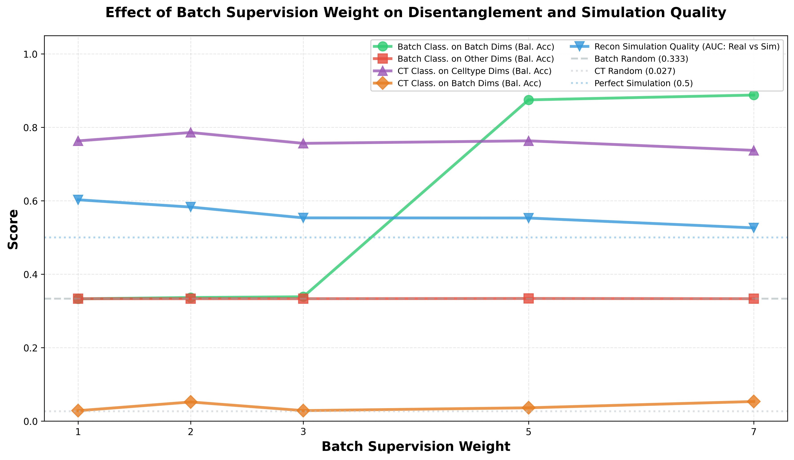

# Controllable Deep Generative Models for Single-Cell Data Simulation

## Goals & Background

Among existing simulators, there is a fundamental trade-off between simulation quality and controllability. The most accurate simulators are often based on deep learning models, which do not expose interpretable parameters that map onto data characteristics such as means, variances, or zero-inflation rates. Classical statistical simulators offer explicit parametric control over these characteristics but fail to capture the complex, high-dimensional structure of real single-cell data.

This study addresses this trade-off by adapting disentangled variational autoencoders and classifier-free guided latent diffusion models for controlled deep-learning-based generation of single-cell data.

**Core Claim:** The trade-off between simulation quality and controllability is not fundamental. Modern generative models can be trained to produce high-fidelity synthetic data while still supporting explicit control over biologically meaningful signals such as batch effects and developmental trajectories.

**Expected Outcomes:**

We evaluate this approach on benchmark datasets with complex experimental designs, including those with varying signal strengths. We evaluate the quality of simulated data before and after control factors have been applied. We demonstrate that our approach retains high simulation quality even after manipulation, whereas classical methods either lack controllability or sacrifice realism when it is applied.

## The Generative Model

### Disentangled VAE

`scdeepsim/src/scdeepsim/truncated_normal_vae.py`

The disentangled VAE is a variational autoencoder that uses:

- a normal distribution as the encoder $q_\phi(z|x)$,
- a zero-inflated truncated normal distribution as the decoder $p_\theta(x|z)$,
- supervised classification heads for covariates.

The decoder distribution is motivated by the empirical properties of log-normalised gene expression: values are non-negative, right-skewed, and exhibit excess zeros. In previous experiments we also tried a plain AE and a ZINB VAE, but simulation quality was not satisfactory; the truncated normal decoder provides the best balance (see discussion on library size below).

The supervised heads impose a structured disentanglement objective. They encourage each known covariate to be predictable from its designated latent block and uninformative outside that block. Specifically, cell-type information is assigned to the first $d_c$ latent dimensions, while batch information is assigned to the next $d_b$ dimensions. This decomposition supports targeted interventions: for example, a batch effect can be introduced by perturbing only the batch-specific subspace, leaving the cell-type subspace unchanged.

The training objectives are:

$$
\begin{align*}
\mathcal L
&= \mathcal L_\text{rec}
 + \beta \mathcal L_\text{KL}
 + \lambda_c CE(h_c(z_c), c)
 + \lambda_b CE(h_b(z_b), b) \\
&\quad + CE(a_b(GRL_{\gamma_t}([z_c,z_r]), emb(c)), b) \\
&\quad + CE(a_c(GRL_{\gamma_t}([z_b,z_r]), emb(b)), c).
\end{align*}
$$

The notation is as follows. The input $x$ denotes the log-normalised gene-expression vector, and $z$ is the latent representation sampled from the encoder. The latent vector is partitioned as

$$
z = [z_c, z_b, z_r],
$$

where $z_c \in \mathbb R^{d_c}$ is the cell-type block, $z_b \in \mathbb R^{d_b}$ is the batch block, and $z_r$ is the residual block. The labels $c$ and $b$ denote the observed cell type and batch, respectively. The terms $\mathcal L_\text{rec}$ and $\mathcal L_\text{KL}$ are the reconstruction loss and the KL divergence to the latent prior. The scalar $\beta$ controls the strength of KL regularisation, while $\lambda_c$ and $\lambda_b$ weight the supervised cell-type and batch classification losses. The function $CE(\cdot,\cdot)$ denotes cross-entropy loss, $h_c$ and $h_b$ are classifiers trained to predict $c$ from $z_c$ and $b$ from $z_b$, and $a_c$ and $a_b$ are adversarial classifiers. The operator $GRL_{\gamma_t}$ is a gradient-reversal layer with strength $\gamma_t$, and $emb(\cdot)$ denotes the embedding of the conditioning covariate supplied to the adversary.

### Why Log-Normalised Space? The Library Size Problem

A critical design decision in this work is to model gene expression in the **log-normalised space** rather than the raw count space. This choice is motivated by the challenge posed by **library size**, which varies dramatically across cells due primarily to technical factors (sequencing depth, capture efficiency).

**The problem with raw count space (ZINB-VAE):** A VAE with a zero-inflated negative binomial (ZINB) decoder operating on raw counts must implicitly learn the library size distribution in addition to the biological expression patterns. In our previous experiments, this approach performed poorly because library size is too noisy and variable to be reliably captured by a generative model. The model conflates library-size-driven variation with biological variation, leading to unrealistic simulated counts.

**scVI's workaround and its limitation:** scVI addresses this problem by conditioning the decoder on the observed library size of each cell. This enables good reconstruction quality (posterior sampling), because the model only needs to learn the expression profile given a known library size. However, this creates a fundamental barrier to genuine simulation: generating a truly new cell requires specifying a library size that does not come from any real observation. scVI's prior sampling mode works around this by borrowing library sizes from real cells (see `sample_from_prior` in `benchmark_simulation.py`), but this dependency means it is not fully generative — the simulated cells are anchored to real cells through their library sizes.

**Our approach:** By working in log-normalised space ($\log(1 + 10^4 \cdot x_i / \sum_j x_j)$), library size is factored out before the data reaches the model. The TN-VAE decoder models the distribution of normalised expression values directly. The diffusion model generates latent vectors in this normalised space, so no library size information is needed at generation time. This is what enables **genuine simulation**: entirely new samples can be generated without reference to any real cell.

**Future experiment:** A systematic comparison of ZINB-VAE (raw count space) vs. TN-VAE (log-normalised space) would formally validate this design choice. It would also be informative to test a ZINB-VAE with explicit library size conditioning (as scVI does) to diagnose whether the ZINB decoder itself or the library size modelling is the root cause of poor performance in raw space.

### Latent Diffusion Model

```text
scdeepsim/src/scdeepsim/diffusion_core.py
scdeepsim/src/scdeepsim/diffusion_model.py
scdeepsim/src/scdeepsim/lightning_diffusion.py
```

The latent diffusion model is a denoising diffusion probabilistic model (DDPM) operating in the VAE's latent space. It uses a U-Net-style MLP to denoise latent vectors, trained on encoded single-cell data with class labels. Two design choices are worth noting:

- **Classifier-free guidance (CFG):** During training, labels are randomly dropped to train an unconditional model. At inference, the conditional and unconditional score estimates are interpolated to control the strength of label conditioning. This is how cell type (or other covariate) conditioning is enforced at generation time.
- **$v$-parameterization:** Instead of predicting noise directly, the model predicts the velocity $v = \sqrt{\bar\alpha}\,\epsilon - \sqrt{1-\bar\alpha}\,x_0$. This improves training stability and sample quality, especially in low-step regimes.

---

## Proposed Control Methods

### Common Primitive: Sample-Linear Affine Interpolation

The control primitive is a linear affine interpolation between two latent distributions. Given source samples $z_s$, source moments $(\mu_0, \Sigma_0)$, target moments $(\mu_1, \Sigma_1)$, and a matrix $B$, define:

$$
T_B(z_s) = \mu_1 + B(z_s - \mu_0)
$$

and interpolate each sample toward its affine endpoint:

$$
z_s(\alpha) = (1 - \alpha) z_s + \alpha T_B(z_s).
$$

Equivalently,

$$
z_s(\alpha) = z_s + \alpha\left[(\mu_1 - \mu_0) + (B - I)(z_s - \mu_0)\right].
$$

The scalar $\alpha$ is the control strength: $\alpha = 0$ leaves samples unchanged, $0 < \alpha < 1$ gives interpolation, $\alpha = 1$ applies the full endpoint map, and $\alpha > 1$ extrapolates the same sample-linear map beyond the target endpoint. This is a post-hoc latent operation and does not require retraining the VAE or diffusion model.

### Choice of $B$

The matrix $B$ is not unique and determines which moment differences are controlled.

**1. Mean-shift affine interpolation.**

$$
B = I
$$

Then the residual term is unchanged, the interpolation reduces to a simple mean shift:

$$
z_s(\alpha) = z_s + \alpha(\mu_1 - \mu_0).
$$

This captures first-moment differences only.

**2. Whitening-recoloring affine interpolation.**

$$
B = \Sigma_1^{1/2}\Sigma_0^{-1/2}
$$

It matches the target mean and covariance by whitening the source residuals and recoloring them with the target covariance.

**3. Gaussian OT / Bures-Wasserstein affine interpolation.**

$$
B = \Sigma_0^{-1/2}\left(\Sigma_0^{1/2}\Sigma_1\Sigma_0^{1/2}\right)^{1/2}\Sigma_0^{-1/2}
$$

This is the closed-form optimal-transport map between Gaussian distributions with squared Euclidean cost. The resulting interpolation is the Bures-Wasserstein / McCann displacement interpolation between the two moment-matched Gaussian endpoints. If the empirical latent distributions are not Gaussian, this should be interpreted only as a second-order affine map between their Gaussian approximations, not as exact OT between empirical distributions.

**Remark:** Distribution-wise linear interpolation may not work for extrapolation. 

Define the interpolated mean and variance:

$$
\mu_\alpha = (1-\alpha)\mu_0 + \alpha \mu_1 \quad \Sigma_\alpha = (1-\alpha)\Sigma_0 + \alpha \Sigma_1
$$

Then the interpolated sample is:

$$
z(\alpha) = \mu_\alpha + \Sigma_\alpha^{1/2}\Sigma_0^{-1/2}(z-\mu_0)
$$

However, $\Sigma_\alpha = (1-\alpha)\Sigma_0 + \alpha \Sigma_1$ may not be positive definite when $\alpha>1$.

### Batch Effect Control

For batch control, the primitive is applied only in the disentangled batch subspace, dimensions $[d_c,\; d_c + d_b)$ of the latent vector. The source and target moments are estimated from the reference and target batch distributions in that subspace, then the controlled batch coordinates are spliced back into the full latent vector before decoding.

This keeps the intended batch manipulation local to the batch-specific coordinates. It also gives a direct signal-strength parameter: $\alpha = 0$ removes the post-hoc batch perturbation, $\alpha = 1$ applies the observed reference-to-target batch map, and $\alpha > 1$ simulates stronger-than-observed batch effects.

**Why not CFG-based batch conditioning?** Although the diffusion model supports classifier-free guidance, CFG reweights learned conditional modes and is not designed to create arbitrary continuous effect strengths outside the observed training conditions. The affine interpolation primitive exposes this strength explicitly through $\alpha$.

### Pseudo-time Control

Pseudo-time represents a cell's position along a continuous developmental or differentiation trajectory. Controlling pseudo-time in simulation means being able to generate cells at any desired developmental stage. A key use case is **benchmarking trajectory inference (TI) methods**: generating synthetic datasets with known ground-truth pseudo-time ordering, so that TI methods can be quantitatively evaluated on their ability to recover this ordering.

**Remark:** A simulator designed to benchmark TI methods **must not use TI methods in its own data generation pipeline**. If a TI method (e.g., Monocle, or even fitting a principal curve in latent space) is used to define the ground-truth trajectory, then the benchmark becomes circular: it evaluates TI methods against a ground truth that was itself produced by a TI method. This rules out the earlier proposal of fitting a principal curve $\gamma(t)$ in the VAE latent space using standard TI tools.

#### Affine Interpolation Between Known States

We construct a ground-truth pseudo-time by interpolating between two or more known cell states in the latent space. Suppose the dataset contains cells from two labelled biological states, such as undifferentiated stem cells and terminally differentiated neurons. After training the disentangled VAE, we encode these cells and estimate source and target moments in the non-batch biological subspace:

$$
P_{\text{start}} \approx (\mu_0, \Sigma_0), \quad P_{\text{end}} \approx (\mu_1, \Sigma_1).
$$

The batch subspace is excluded so that the interpolation captures biological variation only. The latest pseudo-time reruns use the whitening-recoloring affine map,

$$
B = \Sigma_1^{1/2}\Sigma_0^{-1/2},
$$

which whitens the start-state covariance and recolors it to the target-state covariance. Gaussian OT / Bures-Wasserstein remains available as an alternative affine map. Given the chosen $B$, evaluate:

$$
z_s(\alpha) = (1 - \alpha)z_s + \alpha T_B(z_s), \qquad \alpha \in [0, 1].
$$

For any $\alpha$, sampling $z_s$ from the start-state latent distribution and computing $z_s(\alpha)$ yields a latent vector corresponding to developmental progress $\alpha$. Decoding via the VAE produces a synthetic cell with **ground-truth pseudo-time $\alpha$**.

**Could the decoded path be non-trivial?** Although the latent-space path is geometrically simple, the VAE decoder $D: \mathbb{R}^d \to \mathbb{R}^p$ is a highly non-linear mapping trained on real data. The decoded trajectory in gene-expression space can therefore exhibit complex, biologically plausible dynamics. This depends on whether the decoder has learned the real data manifold well.

#### Extension to Branching Trajectories

To simulate non-linear topologies such as bifurcations, we define multiple affine interpolation paths sharing common segments. For example, given four states A (progenitor), B (intermediate), C and D (two terminal fates):

```gantt
    A --------B----- C
              |----- D
```

This produces a bifurcating trajectory. The ground-truth topology and per-branch pseudo-time are known by construction. More complex topologies, such as converging, cyclic, or multi-furcating trajectories, can be built by composing additional affine interpolation segments.

**Data availability.** Datasets containing cells from two or more known discrete states are common in practice: time-course differentiation experiments, reprogramming studies, and embryonic development atlases routinely provide cells labelled by developmental stage or cell state. This makes the "known states" assumption realistic.

#### Controlling Discrepancy between Two Branches

Beyond producing a bifurcation with known topology, we want a continuous knob for **how different the two daughter branches look**, from nearly indistinguishable (low discrepancy) to strongly diverging (high discrepancy). This lets us stress-test TI methods on their ability to resolve branches, not just order cells within one branch.

We expose three approximately independent knobs. All three operate in the non-batch biological subspace and reduce to sample-linear affine interpolation.

**1. Direction and length $(u, r)$: geometric knob.** A branch is characterised by the displacement vector $d = r \cdot u$ from the shared start $A$ to the branch endpoint, where $u$ is a unit direction and $r \ge 0$ is a length. Given a start distribution with moments $(\mu_A, \Sigma_A)$ and a target covariance $\Sigma_{\text{target}}$ (defaulting to $\Sigma_A$, so the branch is a pure translation at $\alpha = 1$), the branch endpoint moments are:

$$
\mu_{\text{target}} = \mu_A + d, \qquad \Sigma_{\text{target}}.
$$

The branch is generated by applying the affine interpolation primitive from $(\mu_A, \Sigma_A)$ to $(\mu_{\text{target}}, \Sigma_{\text{target}})$, with $\alpha \in [0, 1]$ indexing pseudo-time. Sharing $\Sigma_{\text{target}}$ across two branches makes the cosine similarity $\langle u_1, u_2 \rangle$ a clean one-parameter characterisation of directional discrepancy, while $r$ independently controls how far each branch travels. Constructing the $u$ vectors, for example from real endpoints or controlled rotations, is the caller's responsibility and lives outside this primitive.

The existing trajectory interpolation between two observed states is a special case, with $d = \mu_{\text{end}} - \mu_A$ and $\Sigma_{\text{target}} = \Sigma_{\text{end}}$.

**2. Branch-point position $\tau$: topological knob.** Instead of splitting at the root, pick a third observed state $W$ to act as a shared waypoint and split at pseudo-time $\tau \in [0, 1]$. Run three independent affine interpolations, $A \to W$, $W \to B$, and $W \to C$, each over $\alpha \in [0, 1]$, and map them onto a common pseudo-time axis by rescaling:

$$
t_{\text{trunk}} = \tau \cdot \alpha, \qquad t_{\text{branch}} = \tau + (1 - \tau) \cdot \alpha.
$$

This rescaling is purely a relabelling of pseudo-time and leaves the per-segment interpolation unchanged. Cell counts can be allocated proportionally (trunk $\propto \tau$, each branch $\propto 1 - \tau$) to keep density roughly uniform in pseudo-time, and per-cell continuity at $\tau$ can be enforced by using the trunk's $\alpha = 1$ samples as the start of each branch. $\tau \to 0$ recovers a split at the root; $\tau \to 1$ gives a near-linear trajectory with a very late split. This knob controls discrepancy without changing the endpoints, and maps directly onto a ground-truth quantity that TI methods are expected to estimate.

**3. Noise scale $\sigma$: SNR knob.** Orthogonal to geometry and topology, per-branch isotropic Gaussian noise controls the signal-to-noise ratio at which branches are observed. Fixing other parameters and sweeping $\sigma$ gives an SNR-based discrepancy axis that is expected to stress different TI methods differently, such as graph-based methods, principal-curve methods, and diffusion-map methods.

### Possible Extensions: Empirical OT

Empirical OT between finite samples and cell-type-stratified affine maps remain possible future extensions. Empirical OT targets a discrete coupling, whereas the methods above use a closed-form sample-linear affine map.

---

## Experiments

### Simulation Quality Evaluation

```text
experiments/scripts/eval_simulation_quality_scdesign3.py
experiments/configs/eval_simulation_quality_scdesign3.yaml
experiments/scripts/figure3_uncontrolled_quality.py
experiments/configs/figure3_uncontrolled_quality.yaml
```

We compare simulation quality using UMAP visualisation, per-gene expression statistics, and an RF-based discriminability test (real vs. simulated). The earlier scDesign3-only experiment used the Tabula Muris input from the original VAE+Diffusion script, with a default subsample of 5000 cells and 1000 HVGs. The current Figure 3 comparison is configured in `experiments/configs/figure3_uncontrolled_quality.yaml` and uses `data/HVG_embryoatlas.h5ad`, 20,000 selected cells, 2,500 HVGs, a 50/50 stratified train/test split, and RF discriminability on normalised log1p expression. Hydra stores the resolved config and CLI overrides in each output directory under `.hydra/`.

**De novo simulation methods:**

- **scDeepSim(ours):** Latents are sampled from the diffusion model and decoded by the VAE. No original observation is required at generation time. This is the proposed end-to-end generative pipeline.
- **scDesign3:** A classical statistical baseline from the R package `scDesign3`. It fits marginal negative-binomial models conditioned on cell type and a Gaussian copula over genes, then generates new count data that are normalised and log-transformed before comparison. The current Figure 3 run fits the copula on the top 1000 variance genes while keeping all 2500 selected genes in the output.
- **scDiffusion:** An external VAE+diffusion baseline. In the Figure 3 run, the upstream scDiffusion VAE is trained on the selected raw-count subset, a diffusion model is trained in the upstream latent space, sampled latents are decoded, and the resulting normalised log1p expression matrix is compared against the held-out real cells.
- **scVI prior sampling:** manually sample $z \sim \mathcal{N}(0, I)$ and $x \sim p(x|z)$ use scVI. But it still requires externally supplied library size from real cells. (see `sample_from_prior` in `benchmark_simulation.py`, which draws `latent_library` from real observations). This dependency on real-cell library sizes means it is not fully generative.

**Reconstruction methods (not genuine simulation):**

- **VAE reconstruction** ($\text{Decoder}(\text{Encoder}(x))$): Serves as an upper-bound baseline for the best quality our model can achieve by construction.
- **scVI posterior sampling** (`posterior_predictive_sample`): Produces $\text{Decoder}(\text{Encoder}(x))$ with the original cell's library size. This is reconstruction, not genuine simulation. We can compare this against our VAE reconstruction as a **reconstruction quality** benchmark.
- **ZINB-WaVE:** A count-space statistical simulator fitted with `zinbwave::zinbFit` and sampled with `zinbwave::zinbSim`. In this run it uses the observed cell-type design matrix, two latent factors (`K=2`), common dispersion, and zero inflation, so it is best interpreted as a metadata-conditioned count baseline rather than an end-to-end latent generative model.

<!-- 

The UMAP comparison includes real data, VAE reconstruction, VAE+Diffusion, and scDesign3 in a shared embedding. VAE reconstruction remains closest to the real data by construction. VAE+Diffusion preserves much of the cell-type topology but accumulates end-to-end generation error. scDesign3 preserves broad cell-type composition but remains easier to distinguish from real data in gene space. -->

<!-- 

The per-gene mean and variance correlations are high for both genuine simulators. VAE+Diffusion achieved mean correlation 0.995 and variance correlation 0.991. scDesign3 achieved mean correlation 0.996 and variance correlation 0.981. Thus marginal gene statistics alone are not sufficient to establish realism; discriminability remains necessary. -->

<!--  -->

We assess discriminability via an RF classifier trained to distinguish real from simulated data. **A lower AUC (closer to 0.5) indicates better simulation quality** — the simulated data is harder to distinguish from real data.

<!-- The current run produced:

- **Latent AUC 0.660 / accuracy 0.612:** Discriminability of diffusion-sampled latents vs. real encoded latents (latent space).
- **VAE reconstruction AUC 0.744 / accuracy 0.679:** Reconstruction upper-bound reference in gene space.
- **VAE+Diffusion AUC 0.944 / accuracy 0.870:** End-to-end genuine simulation in gene space.
- **scDesign3 AUC 0.988 / accuracy 0.951:** Classical simulation baseline in gene space. -->

<!-- In a fair gene-space comparison, VAE+Diffusion is less distinguishable from real data than scDesign3 on this subsample, despite both methods matching gene-level means and variances closely. The remaining gap between latent-space quality and gene-space quality still suggests that decoding/gene-space fidelity is a major bottleneck. -->

**De novo simulation methods comparison**


Caption: De novo simulation comparison on `data/HVG_embryoatlas.h5ad` using 20,000 cells, 2,500 HVGs, a 50/50 stratified train/test split, and RF real-vs-simulated discriminability.

**Reconstruction Methods Comparison**


Caption: Reconstruction/reference-conditioned comparison on the same `HVG_embryoatlas.h5ad` split and evaluation settings.

<!-- **Todo:**

- [x] Add scDesign3 (R package) as a genuine simulation benchmark.
- [x] Reframe scVI comparison: compare scVI posterior against our VAE reconstruction (reconstruction quality), and note that scVI prior sampling is not fully generative due to library size dependence. -->

<!-- - [ ] Ablation: systematic comparison of TN-VAE (log-normalised space) vs. ZINB-VAE (raw count space) to formally validate the choice of working in log-normalised space. See the library size discussion above. -->

---

### Disentanglement Evaluation

We evaluate the disentanglement of latent variables produced by the disentangled VAE by varying the supervision weight from 1.0 to 7.0. A secondary RF classifier is trained to predict cell type from (a) the cell-type latent subspace and (b) the remaining latent dimensions.


As the supervision weight increases, the AUC on cell-type latents consistently rises while the AUC on the remaining dimensions approaches chance level. Critically, the overall simulation quality (real vs. simulated AUC) is not substantially affected, confirming that enforcing disentanglement does not degrade the generative quality.

We also conducted a batch disentanglement evaluation on the scIBPancreas dataset:




Caption: Latent disentanglement heatmap on `data/HVG_embryoatlas.h5ad` using 2,000 HVGs. Cell type and sequencing-batch labels are supervised into separate 32-dimensional latent subspaces, and RF predictability is evaluated with an 80/20 train/test split.

---

### Batch Effect Signal Measurement

**Status:** The dose-response metrics and the controlled batch-integration benchmark are implemented. The integration benchmark uses cell-type-stratified absolute batch ASW, raw unweighted $k=30$ iLISI/cLISI, and signed cell-type ASW; these are implemented in `experiments/src/batch_metrics.py`.

After introducing batch effect signals via latent manipulation, we need to verify two things: (a) the batch signal is present and its strength is controllable via $\alpha$, and (b) biological signals (cell type structure) are preserved. Note that introducing batch effects is *expected* to change marginal gene-expression statistics and make the data look different from the unmanipulated simulation -- that is the whole point. Therefore, standard real-vs.-simulated discriminability tests are not directly applicable to the manipulated data (there is no "manipulated real data" to compare against).

#### Dose-Response Evaluation of Batch Effect Strength

The central evaluation is a **dose-response curve**: for a range of $\alpha$ values (e.g., $\alpha \in \{0, 0.25, 0.5, 0.75, 1.0, 1.5, 2.0\}$), compute the following batch separation metrics and plot them as a function of $\alpha$.

- **Batch ASW (Average Silhouette Width):** Measures whether cells from the same batch are closer to each other than to cells from other batches. Higher ASW (closer to +1) indicates stronger batch separation.

$$
s(i) = \frac{b(i) - a(i)}{\max(a(i), b(i))}
$$

  where $a(i)$ is the mean intra-batch distance and $b(i)$ is the mean nearest-batch distance for cell $i$.

- **iLISI (integration LISI):** Measures local mixing of batch labels. Higher iLISI indicates more mixing; lower iLISI indicates stronger batch separation. We expect iLISI to decrease monotonically with $\alpha$.

$$
\text{LISI} = \frac{1}{\sum_c p_c^2}
$$

- **kBET (k-nearest neighbour Batch Effect Test):** Tests the null hypothesis that local neighbourhood composition matches the global batch proportion. Higher rejection rate indicates a stronger batch effect.

**Expected outcome:** A monotonically increasing trend in Batch ASW and kBET rejection rate, and a monotonically decreasing trend in iLISI, as $\alpha$ increases. This demonstrates that the batch signal strength is **continuously tunable** via the $\alpha$ parameter.

#### Biological Signal Preservation

These metrics should remain **stable across all $\alpha$ values**, confirming that the disentanglement is effective and batch manipulation does not leak into the biological subspace.

- **Cell type classification accuracy:** Train an RF classifier on cell type labels using the manipulated data. High accuracy confirms that cell types remain separable.
- **Cell type ASW (cASW):** Measures whether cells cluster by cell type after manipulation. Should remain high.
- **Isolated labels ASW:** Evaluates whether rare cell types are still correctly separated.
- **cLISI (cell type LISI):** Measures local mixing of cell type labels. Should remain low (cells of the same type stay together).

Plot the biological metrics alongside the batch metrics as a function of $\alpha$. The key finding would be that batch metrics change continuously with $\alpha$ while biological metrics remain flat.

We run the experiment `experiments/scripts/eval_batch_dose_response.py` for the evaluation for both the mean-shift and the Gaussian OT direction.

**Mean-Shift:**


**Gaussian OT:**


Dose-response evaluation of batch-strength manipulation using Gaussian OT transport direction. Data are generated by moving cells from the reference batch toward the target batch along the Gaussian OT transport direction, with the interpolation coefficient $\alpha$ controlling the magnitude of the shift ($\alpha = 0$: no shift; $\alpha = 1$: full transport to the target batch; $\alpha > 1$: extrapolation beyond the target). Left: Batch ASW (solid green, left axis) increases monotonically and LISI (dashed red, right axis) decreases monotonically with $\alpha$, confirming that the degree of batch separation grows continuously as cells are displaced further toward the target batch. Right: Cell-type ASW (purple), cell-type RF balanced accuracy (blue), and cLISI (orange) remain stable across all $\alpha$ values and are consistent with the reference batch baselines, indicating that biological signal is preserved throughout the interpolation.

#### Batch Integration Methods Benchmarking

**Status:** The full run is stored in `experiments/outputs/batch_integration_full/`.

##### Benchmark Design

The benchmark is designed as a controlled stress test in which the biological composition, sampled cells, genes, and integration parameters are fixed while only the strength of an introduced technical batch effect changes.

1. **Fit one shared generative model.** The experiment uses all 16,382 cells and one fixed set of 2,000 HVGs from the `counts` layer of `data/scIBPancreas.h5ad`, followed by library-size normalization and `log1p`. A classifier-plus-adversarial VAE has a 128-dimensional latent space with cell-type dimensions $[0,8)$ and batch dimensions $[8,16)$. A single latent diffusion model is jointly conditioned on all 14 cell types and 9 technologies. These models are trained once and reused for every benchmark task.

2. **Estimate one real-data batch map.** The technical intervention is a pooled inDrop3-to-smartseq2 whitening-recoloring map fitted only in the eight-dimensional VAE batch block. To avoid confounding batch and cell-type composition, real cells are restricted to acinar, activated stellate, alpha, beta, delta, and ductal cells, and each cell type contributes the same number of inDrop3 and smartseq2 cells, determined by the smaller technology-specific group. Pooling these matched strata gives 2,062 cells per technology. A covariance ridge of $10^{-6}I$ is added when estimating the affine map.

3. **Generate paired de novo cohorts.** For each sampling seed (42, 43, and 44), the diffusion model independently generates cohort A and cohort B. Both cohorts are conditioned on inDrop3 and contain exactly 500 cells from each of the six cell types, giving 3,000 cells per cohort and 6,000 cells per integration task. This creates known, balanced cell-type composition without borrowing real observations at generation time.

4. **Vary only intervention strength.** The same two base latent cohorts are reused for $\alpha \in \{0,0.5,1.0,1.5,2.0\}$. Cohort A is unchanged at every alpha. Cohort B is transformed only in latent dimensions $[8,16)$ using sample-linear affine interpolation toward the smartseq2 endpoint; all cell-type and residual coordinates are asserted unchanged. Thus $\alpha=0$ is a synthetic null, $\alpha=1$ applies the full estimated real-data map, and $\alpha>1$ extrapolates to stronger-than-observed batch effects. No moment anchoring is applied after diffusion sampling.

5. **Apply integration methods under fixed inputs.** Each decoded task uses the same 2,000 genes and is passed to unintegrated PCA, ComBat, Harmony, and Scanorama. Methods receive only the synthetic batch labels, never cell-type labels. Expression is not renormalized, rescaled, or subjected to another HVG selection. Unintegrated, Harmony, and Scanorama start from the same fixed-seed 30-dimensional PCA; ComBat corrects expression first and is followed by a fresh 30-dimensional PCA. Published/default method parameters are kept fixed across alpha values.

6. **Evaluate technical removal and biological preservation.** Every successful 30-dimensional embedding is scored with four complementary metrics. Batch ASW is computed within each cell type using absolute silhouette values and then averaged equally across cell types (lower is better). Raw unweighted $k=30$ iLISI measures local batch mixing (higher is better). Signed cell-type ASW measures global biological separation (higher is better), while raw $k=30$ cLISI measures local cell-type purity (lower is better). Results are summarized as means with $\pm1$ SD over the three independently generated cohort pairs.

This paired construction is important: integration methods see exactly the same cells at a given seed and alpha, and comparisons across alpha reuse the same underlying latent cohorts. Consequently, changes in integration performance can be attributed to the controlled batch intervention rather than to composition changes or resampling noise. Adapter failures are recorded without stopping other methods; the completed run produced all $3 \times 5 \times 4=60$ rows successfully with finite metrics.


Caption: Mean response curves with $\pm1$ SD across three independently sampled cohort pairs. Lower batch ASW and higher iLISI indicate stronger integration; higher cell-type ASW and lower cLISI indicate better biological preservation. Harmony gives the strongest correction across moderate and high intervention strengths, ComBat gives partial correction, and Scanorama overlaps unintegrated PCA because it returned unchanged embeddings in this run.

#### Validating Realism of the Introduced Batch Effects

**Challenge:** We cannot directly use real-vs.-simulated discriminability to assess the manipulated data, because we are generating data with batch effects that do not exist in reality. We need alternative strategies to argue the introduced effects are realistic.

**Proposed validation strategies:**

1. **Held-out batch validation:** Take a dataset with known real batch effects. Train the model on only the reference batch. Generate data for the target batches using the learned batch directions (with $\alpha = 1$). Compare the generated target-batch data against the held-out real target-batch data using per-gene correlations, UMAP overlap, and batch-separation metrics. This directly tests whether the model can recover a known batch effect.

2. **Qualitative plausibility (UMAP visualisation):** Show UMAP visualisations of simulated data at different $\alpha$ values ($0, 0.5, 1.0, 1.5, 2.0$). The cluster topology should deform smoothly as $\alpha$ increases, without producing artifacts or unrealistic cluster fragmentation.

We visualized the trajectory of generated samples at different $\alpha$ values:

**Mean-Shift:**


**Gaussian OT:**


UMAP visualization of batch interpolation and extrapolation along the Gaussian OT transport direction. Reference batch (inDrop3, triangles) and target batch (Smart-seq2, squares) cells are shown alongside generated cells at $\alpha \in \{0.0, 0.5, 1.0, 1.5\}$ (color-coded from dark purple to yellow). Generated cells shift continuously from the reference position ($\alpha = 0$) toward and beyond the target ($\alpha = 1.5$), with smooth spatial transitions across UMAP clusters.

**Held-out batch validation:**


The VAE+Diffusion model fails to generate synthetic data that they have never seen before.

**scGen Style Held-out Batch Validation:**

This experiment follows a scGen-style held-out cell-type transfer setup. We
selected a reference and target batch (`inDrop3 -> smartseq2`) and held out one
cell type (`alpha`) from the target batch. The supervised VAE was trained on all
cells except real `smartseq2 alpha` cells. A pooled latent batch transform was
then estimated from all non-alpha cells shared between `inDrop3` and
`smartseq2` using whitening-recoloring in the batch-supervised latent subspace
(`alpha = 1`). Finally, the transform was applied to `inDrop3 alpha` cells,
decoded, and evaluated against the held-out real `smartseq2 alpha` cells.

In this run, the model predicted 671 transferred alpha cells and compared them
with 619 held-out real target cells across 2,000 genes. Mean-expression
agreement was high across all genes ($r = 0.983$, $R^2 = 0.966$) and remained
high for the top 100 reference-vs-target DE genes ($r = 0.962$,
$R^2 = 0.922$). Gene-wise standard deviation agreement was also strong
($r = 0.932$, $R^2 = 0.856$).


### Checking Assumptions of Gaussian OT

The Gaussian OT approach assumes that the data is Gaussian distributed and have different covariance matrices for different batches. 

We check the normality assumption by a Mahalanobis QQ plot.


It seems that the Gaussian assumption does not hold for the batch latents.

We then check the covariance structure by a covariance spectra and relative Frobenius heatmap.


The spectrum of the matrices looks similar, but the relative Frobenius distances are still high. This suggests that the direction of the eigenvectors might be different. Let's verify this by looking at the principle angles of the subspaces. Let $U_A, U_B \in \mathbb{R}^{d \times k}$ be the subspaces spanned by the top $k$ principal components of the batch latents for batch A and B, respectively. The SVD decomposition gives: 

$$
U_i^{\top} U_j=P \Sigma Q^{\top}, \quad \Sigma=\operatorname{diag}\left(\cos \theta_1, \ldots, \cos \theta_k\right).
$$

Then $\theta_1 \leq \theta_2 \leq \dots \leq \theta_k$ are the principle angles. 


--- 

### Pseudo-time Interpolation

Trajectory interpolation between Ductal cells and Beta cells visualization. This linear example is a sanity check for the generated ordering, not the primary TI benchmark. The June 29, 2026 rerun uses whitening-recoloring affine interpolation.


Manipulating discrepancy between two branches. These qualitative examples motivate the benchmark setting: branch difficulty can be varied, and TI methods should be evaluated by their ordering and topology recovery across these regimes.

Before:


After:


Branching point control:


Pseudo-time dose-response check:


With whitening-recoloring, the dose-response is monotone: ASW increases from -0.000071 at $\alpha=0$ to 0.2383 at $\alpha=1$, while LISI decreases from 1.9202 to 1.0000.

### TI Methods Benchmarking

The main use of pseudo-time control is a **direct benchmark of trajectory inference (TI) methods**. Each generated dataset is evaluated by whether TI methods recover the known ordering and branching structure. The central claim is that scDeepSim can generate controlled branching datasets with known ground truth, so method performance can be measured as a function of branch difficulty.

The primary task is **bifurcating trajectory recovery**. Some methods recover a shared trunk and two daughter lineages, some collapse the structure into a single path, and some detect branches but misplace the branch point.

Each benchmark replicate should export the generated expression matrix together with ground-truth metadata:

- `true_pseudotime`: the common pseudo-time coordinate $t \in [0, 1]$.
- `true_lineage`: trunk, branch B, or branch C.
- `simulator_settings`: branch endpoint discrepancy, branch-point $\tau$, noise scale, sample count, random seed, and any endpoint states used to define the OT paths.

The main difficulty axes are:

- **Branch endpoint discrepancy:** controlled by branch direction, branch length, and endpoint Wasserstein distance.
- **Branch-point position $\tau$:** controls whether the split occurs early or late.
- **Noise scale $\sigma$:** controls how visible the branch structure is after decoding.

The benchmark should vary one difficulty axis at a time while keeping the other simulator settings fixed. The reported figure of merit is not whether a knob changes monotonically; it is whether different TI methods separate in performance as the generated trajectory becomes harder.

#### TI Methods and Interfaces

The initial canonical method set should include Slingshot, Monocle3, and Scanpy DPT/PAGA. Slingshot and Monocle3 are R-based methods and should be used through experiment-level adapters rather than added as dependencies of the `scdeepsim` Python package. Scanpy DPT/PAGA can run directly in the Python experiment environment.

**Slingshot.** Slingshot constructs a minimum spanning tree over clusters in a reduced-dimensional space and then fits simultaneous principal curves through the resulting lineage structure. Its inputs are PCA/UMAP coordinates plus cluster labels and a specified root cluster. The adapter should provide the same embedding and clustering used for the other methods when possible, then collect per-cell pseudotime and lineage assignment.

**Monocle3.** Monocle3 learns a principal graph over cells after dimensionality reduction and assigns pseudotime by ordering cells along the learned graph from a chosen root. Its inputs are an expression matrix or reduced representation, cell metadata, and a root cell or root group. The adapter should collect graph pseudotime, branch or partition assignments when available, and enough graph metadata to classify the inferred topology.

**Scanpy DPT/PAGA.** PAGA estimates coarse graph connectivity between cell groups, while DPT computes diffusion pseudotime from a root cell on the neighbour graph. Its inputs are an `AnnData` object, a neighbour graph, a root cell or root group, and optional clusters for PAGA. The Python runner should collect DPT pseudotime and use the PAGA graph as the inferred coarse topology.

All methods should write a standardized output table keyed by cell id:

- `method`
- `inferred_pseudotime`
- `inferred_lineage`
- method metadata such as root setting, embedding, clustering, and parameter values.

This adapter boundary keeps method-specific dependencies isolated while making evaluation method-agnostic.

#### Evaluation Metrics

**Ordering recovery.** Compute Spearman correlation between inferred pseudotime and `true_pseudotime`. Report it globally and per lineage. Rank correlation is preferred because TI methods are only expected to recover a monotone transformation of the true pseudo-time, not the exact scale.

**Branch and topology recovery.** Compare inferred lineage labels with `true_lineage` using  or balanced accuracy after optimal label mARIatching. When a method exposes a branch point, report branch-point localization error relative to $\tau$. Also classify the inferred topology into a small set of interpretable outcomes: correct bifurcation, unresolved linear trajectory, or wrong branching structure.

**Method discrimination.** Plot each metric as a function of branch difficulty. A useful benchmark is one where methods separate meaningfully across discrepancy, $\tau$, or noise settings. A dataset family where all methods score uniformly high or uniformly low is less informative, even if the simulated data look plausible.

#### Results

Updated June 29, 2026 reruns use whitening-recoloring affine interpolation (`generation.affine_method=whitening_recoloring`) with 3 replicates per setting, 2,000 genes, 21 pseudo-time grid values, and 100 cells per grid value.

TI Methods Benchmarking Across Branch Endpoint Discrepancy. DPT/PAGA improves strongly as discrepancy increases: mean global Spearman rises from 0.480 at discrepancy 0.2 to 0.874 at 1.4, and lineage ARI rises from 0.002 to 0.158. Monocle3 improves at high discrepancy but keeps near-zero lineage ARI; Slingshot is strongest only at the lowest discrepancy values and is more variable.


TI Methods Benchmarking Across Branch Point Position $\tau$.

DPT/PAGA is the most stable through $\tau=0.5$, with mean Spearman 0.806, 0.852, and 0.853 at $\tau=0$, 0.25, and 0.5. At $\tau=0.75$, Slingshot slightly leads in ordering (0.751 vs. 0.749 for DPT/PAGA) but has poor lineage ARI. Topology recovery remains much harder than ordering recovery.


TI Methods Benchmarking Across Noise Scale $\sigma$.

DPT/PAGA is best through moderate noise, with mean Spearman 0.806, 0.817, and 0.725 at $\sigma=0$, 0.5, and 1.0. At $\sigma=1.5$, Monocle3 is highest (0.534), and at $\sigma=2.0$ all methods are weak and high-variance: Slingshot, DPT/PAGA, and Monocle3 average 0.239, 0.189, and 0.146, respectively.


---

## Experiment and Coding Disciplines

- Use `Hydra` to manage experiments, keep experiments reproducible and trackable.
- Decoupling and clearity over reusability.

---

## Summary of Open Tasks

**High Priority**

- [ ] Replace legacy mean-shift/Gaussian-OT experiments with whitening-recoloring interpolation method.

- [x] Implement $\alpha$-parameterised batch direction shift in generation pipeline (batch subspace only)

- [x] Run batch disentanglement evaluation (replicate cell-type disentanglement experiment with batch labels) — Conducted on embryo atlas dataset

- [x] Implement Gaussian OT direction finding (compare against mean-shift)

- [x] Dose-response batch evaluation ($\alpha$ vs. Batch ASW / iLISI / kBET + biological preservation metrics)

- [x] Batch-integration benchmark across unintegrated PCA, ComBat, Harmony, and Scanorama

- [ ] Diagnose why Scanorama returned unchanged PCA embeddings for every batch-integration task

- [x] Implement pseudo-time trajectory manipulation

- [x] Evaluate pseudo-time trajectory manipulation?

- [x] Evluate branching point manipulation.

- [x] Consolidate the way to benchmarking TI methods with our simulator

- [-] Ablation study: Do we really need the supervision heads + adversarial heads setting? Considering keeping only one of them.

- [ ] Scalability test: run across multiple data sizes?

**Medium Priority**

- [x] Held-out batch validation experiment

- [x] Add scDesign3 to genuine simulation benchmark

- [x] Reframe scVI comparison (reconstruction quality only)

- [ ] Interpolation strategy: In the slice we want to control, or all subspaces excluding the one we want to preserve?

- [ ] Synthetic Null?

- [ ] Batch Effect Benchmark: Observe difference with the traditional simulator benchmarking(splatter)

**Low Priority**

- [ ] Library size ablation: TN-VAE (log-normalised) vs. ZINB-VAE (raw counts)
- [ ] Investigate why non-gaussian lantent distribution
- [ ] Control data characteristics instead of just signal strengths
